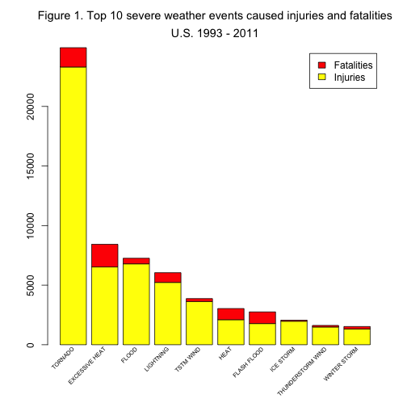
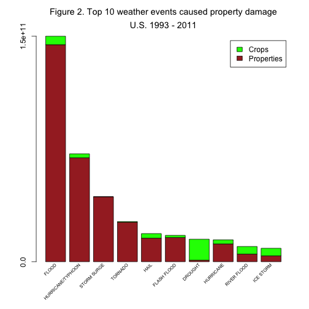

# Analysis of impacts on the economy and population health  of severe weather events in the U.S.
by David Solis for Reproducible Research (Johns Hopkins University via Coursera) Assignment 2

This report explores the U.S. National Oceanic and Atmospheric Administration's (NOAA) storm database. This database tracks the occurrence of storms and other significant weather phenomena having sufficient intensity to cause loss of life, injuries, significant property damage, and/or disruption to commerce.

## Synopsis

The NOAA [storm database](https://d396qusza40orc.cloudfront.net/repdata%2Fdata%2FStormData.csv.bz2) was used to compare outcomes from severe weather events. 

For the purpose of this analysis, the date range will be limited to 1993 to 2011^1.

The data analysis addressed the following questions:

* Across the United States, which types of events (as indicated in the EVTYPE variable) are most harmful with respect to population health? 
The highest fatalities and injuries were caused by tornadoes.
* Across the United States, which types of events have the greatest economic consequences? 
The highest property damage resulted from floods and the highest crop damage results from draughts.

^1 Since 1993 the data have been entered digitally into computer-based records by NWS personnel and loaded into the Storm Events Database. 

## Data Processing
### Load packages

```r
packages <- c("xtable")
sapply(packages, require, character.only = TRUE, quietly = TRUE)
```

```
## xtable 
##   TRUE
```


### Download 
The NOAA storm database was obtained from the the Reproducible Research course's web site.

```r
setwd("~/Documents/reproducible-research/assignments/git-repository/peer-assessment-2")
raw.data.file.name <- "storm-raw-data.csv.bz2"

if (!file.exists(raw.data.file.name)) {
    download.file("https://d396qusza40orc.cloudfront.net/repdata%2Fdata%2FStormData.csv.bz2", 
        raw.data.file.name, method = "wget", extra = "--no-check-certificate")
}
```


### Loading, subsetting and cleaning
The following fields were used for this analysis:

| **Field**   | **Description** |
| :---------- | :---------------------------
| BGN_DATE    | Date the storm event began
| EVTYPE      | Type of storm event (not abbreviated)
| FATALITIES  | The number of deaths directly related to the weather event
| INJURIES    | The number of injuries directly related to the weather event
| PROPDMG     | The estimated amount of damage to property incurred by the weather event (whole numbers and hundredths)
| PROPDMGEXP  | A multiplier where "H" denotes hundreds, 'K” denotes thousands, “M” denotes millions, and “B” denotes billions
| CROPDMG     | The estimated amount of damage to crops incurred by the weather event (whole numbers and hundredths)
| CROPDMGEXP  | A multiplier where "H" denotes hundreds, 'K” denotes thousands, “M” denotes millions, and “B” denotes billions

Code below implements:
* The date range was limited to 1993 to 2011 (horizontal subset).
* Use a vertical subset - see fields above
* Adjust property and crop multipliers
* Property and crop damage estimate numbers were multiplied with their respective multipliers
* Clean event type, were trimmed multiple spaces, leading and trailing spaces


```r
data.file.name <- "storm-data.csv"

if (!file.exists(data.file.name)) {
    raw.data <- read.csv(bzfile(raw.data.file.name), header = TRUE, stringsAsFactors = FALSE)
    
    raw.data$BGN_DATE <- as.Date(raw.data$BGN_DATE, format = "%m/%d/%Y %H:%M:%S")
    # Horizontal subset
    data <- raw.data[raw.data$BGN_DATE >= as.Date("1993-01-01"), ]
    data <- data[data$INJURIES > 0 | data$FATALITIES > 0 | data$PROPDMG > 0 | 
        data$CROPDMG > 0, ]
    # Vertical subset - limit the data to the required fields.
    data <- data[, c("BGN_DATE", "EVTYPE", "FATALITIES", "INJURIES", "PROPDMG", 
        "PROPDMGEXP", "CROPDMG", "CROPDMGEXP")]
    # Transform PROPDMG multiplier
    data$PROPDMGEXP[is.na(data$PROPDMGEXP)] <- 0
    data$PROPDMGEXP[data$PROPDMGEXP == ""] <- 1
    data$PROPDMGEXP[grep("[-+?]", data$PROPDMGEXP)] <- 1
    data$PROPDMGEXP[grep("[Hh]", data$PROPDMGEXP)] <- 100
    data$PROPDMGEXP[grep("[Kk]", data$PROPDMGEXP)] <- 1000
    data$PROPDMGEXP[grep("[Mm]", data$PROPDMGEXP)] <- 1e+06
    data$PROPDMGEXP[data$PROPDMGEXP == "B"] <- 1e+09
    data$PROPDMGEXP <- as.numeric(data$PROPDMGEXP)
    # Transform CROPDMG multiplier
    data$CROPDMGEXP[is.na(data$CROPDMGEXP)] <- 0
    data$CROPDMGEXP[data$CROPDMGEXP == ""] <- 1
    data$CROPDMGEXP[grep("[-+?]", data$CROPDMGEXP)] <- 1
    data$CROPDMGEXP[grep("[Hh]", data$CROPDMGEXP)] <- 100
    data$CROPDMGEXP[grep("[Kk]", data$CROPDMGEXP)] <- 1000
    data$CROPDMGEXP[grep("[Mm]", data$CROPDMGEXP)] <- 1e+06
    data$CROPDMGEXP[data$CROPDMGEXP == "B"] <- 1e+09
    data$CROPDMGEXP <- as.numeric(data$CROPDMGEXP)
    # Adjust property and crop damages
    data$PROPDMG <- data$PROPDMG * data$PROPDMGEXP
    data$CROPDMG <- data$CROPDMG * data$CROPDMGEXP
    
    # Clean Event Type
    data$EVTYPE <- toupper(data$EVTYPE)
    # Trim multiple spaces and leading, trailing spaces
    trim <- function(x) gsub("[[:space:]]{2,}", " ", gsub("(^[[:space:]]+|[[:space:]]+$)", 
        "", x))
    data$EVTYPE <- trim(data$EVTYPE)
    
    write.csv(data, file = data.file.name, row.names = FALSE)
} else {
    data <- read.csv(data.file.name, header = TRUE, stringsAsFactors = FALSE)
}
```


## Results
Code below generates first dataset to produce answer to the first question.

### Impacts on  population health

```r
population.health.data <- data[, c("EVTYPE", "INJURIES", "FATALITIES")]
population.health.data <- aggregate.data.frame(x = population.health.data[, 
    c(2, 3)], by = list(population.health.data$EVTYPE), FUN = sum)
colnames(population.health.data)[1] <- "EVTYPE"
population.health.data$TOTAL <- population.health.data$FATALITIES + population.health.data$INJURIES
population.health.data <- population.health.data[order(population.health.data$TOTAL, 
    decreasing = TRUE), ]
row.names(population.health.data) <- population.health.data$EVTYPE
population.health.data <- population.health.data[population.health.data$TOTAL != 
    0, ]
```


```r
population.health.table <- xtable(population.health.data[1:10, c("INJURIES", 
    "FATALITIES")], caption = "Table 1. Event types that accounted for the highest cumulative injuries and fatalities")
names(population.health.table) <- c("Injuries", "Fatalities")
print(population.health.table, type = "html")
```

<!-- html table generated in R 3.1.0 by xtable 1.7-3 package -->
<!-- Sun May 25 01:28:44 2014 -->
<TABLE border=1>
<CAPTION ALIGN="bottom"> Table 1. Event types that accounted for the highest cumulative injuries and fatalities </CAPTION>
<TR> <TH>  </TH> <TH> Injuries </TH> <TH> Fatalities </TH>  </TR>
  <TR> <TD align="right"> TORNADO </TD> <TD align="right"> 23310 </TD> <TD align="right"> 1621 </TD> </TR>
  <TR> <TD align="right"> EXCESSIVE HEAT </TD> <TD align="right"> 6525 </TD> <TD align="right"> 1903 </TD> </TR>
  <TR> <TD align="right"> FLOOD </TD> <TD align="right"> 6789 </TD> <TD align="right"> 470 </TD> </TR>
  <TR> <TD align="right"> LIGHTNING </TD> <TD align="right"> 5230 </TD> <TD align="right"> 816 </TD> </TR>
  <TR> <TD align="right"> TSTM WIND </TD> <TD align="right"> 3631 </TD> <TD align="right"> 241 </TD> </TR>
  <TR> <TD align="right"> HEAT </TD> <TD align="right"> 2100 </TD> <TD align="right"> 937 </TD> </TR>
  <TR> <TD align="right"> FLASH FLOOD </TD> <TD align="right"> 1777 </TD> <TD align="right"> 978 </TD> </TR>
  <TR> <TD align="right"> ICE STORM </TD> <TD align="right"> 1975 </TD> <TD align="right">  89 </TD> </TR>
  <TR> <TD align="right"> THUNDERSTORM WIND </TD> <TD align="right"> 1488 </TD> <TD align="right"> 133 </TD> </TR>
  <TR> <TD align="right"> WINTER STORM </TD> <TD align="right"> 1321 </TD> <TD align="right"> 206 </TD> </TR>
   </TABLE>


**Plot generation**

```r
population.health.plot <- barplot(height = t(as.matrix(population.health.data[1:10, 
    c("INJURIES", "FATALITIES")])), main = bquote(atop("Figure 1. Top 10 severe weather events caused injuries and fatalities", 
    "U.S. 1993 - 2011")), legend = c("Injuries", "Fatalities"), axes = FALSE, 
    axisnames = FALSE, col = c("yellow", "red"))

text(population.health.plot, par("usr")[3], labels = row.names(population.health.data)[1:10], 
    srt = 45, adj = 1, cex = 0.6, xpd = TRUE)
axis(2)
```

 

The figure above illustrates the impact of extreme weather events on the health of the community.

Code below generates second dataset to produce answer to the second question.

### Impacts on the economy

```r
economy.data <- data[, c("EVTYPE", "PROPDMG", "CROPDMG")]
economy.data <- aggregate.data.frame(x = economy.data[, c(2, 3)], by = list(economy.data$EVTYPE), 
    FUN = sum)
colnames(economy.data)[1] <- "EVTYPE"
economy.data$TOTAL <- economy.data$PROPDMG + economy.data$CROPDMG
economy.data <- economy.data[order(economy.data$TOTAL, decreasing = TRUE), ]
row.names(economy.data) <- economy.data$EVTYPE
economy.data <- economy.data[economy.data$TOTAL != 0, ]
```


```r
economy.table <- xtable(economy.data[1:10, c("PROPDMG", "CROPDMG")], caption = "Table 2. Event types that accounted for the highest property damage and crop damage")
names(economy.table) <- c("Property Damage", "Crop Damage")
print(economy.table, type = "html")
```

<!-- html table generated in R 3.1.0 by xtable 1.7-3 package -->
<!-- Sun May 25 01:28:46 2014 -->
<TABLE border=1>
<CAPTION ALIGN="bottom"> Table 2. Event types that accounted for the highest property damage and crop damage </CAPTION>
<TR> <TH>  </TH> <TH> Property Damage </TH> <TH> Crop Damage </TH>  </TR>
  <TR> <TD align="right"> FLOOD </TD> <TD align="right"> 144657709807.00 </TD> <TD align="right"> 5661968450.00 </TD> </TR>
  <TR> <TD align="right"> HURRICANE/TYPHOON </TD> <TD align="right"> 69305840000.00 </TD> <TD align="right"> 2607872800.00 </TD> </TR>
  <TR> <TD align="right"> STORM SURGE </TD> <TD align="right"> 43323536000.00 </TD> <TD align="right"> 5000.00 </TD> </TR>
  <TR> <TD align="right"> TORNADO </TD> <TD align="right"> 26338962484.00 </TD> <TD align="right"> 414953110.00 </TD> </TR>
  <TR> <TD align="right"> HAIL </TD> <TD align="right"> 15732267427.00 </TD> <TD align="right"> 3025954453.00 </TD> </TR>
  <TR> <TD align="right"> FLASH FLOOD </TD> <TD align="right"> 16140862293.80 </TD> <TD align="right"> 1421317100.00 </TD> </TR>
  <TR> <TD align="right"> DROUGHT </TD> <TD align="right"> 1046106000.00 </TD> <TD align="right"> 13972566000.00 </TD> </TR>
  <TR> <TD align="right"> HURRICANE </TD> <TD align="right"> 11868319010.00 </TD> <TD align="right"> 2741910000.00 </TD> </TR>
  <TR> <TD align="right"> RIVER FLOOD </TD> <TD align="right"> 5118945500.00 </TD> <TD align="right"> 5029459000.00 </TD> </TR>
  <TR> <TD align="right"> ICE STORM </TD> <TD align="right"> 3944927810.00 </TD> <TD align="right"> 5022113500.00 </TD> </TR>
   </TABLE>


**Plot generation**

```r
economy.plot <- barplot(height = t(as.matrix(economy.data[1:10, c("PROPDMG", 
    "CROPDMG")])), main = bquote(atop("Figure 2. Top 10 weather events caused property damage", 
    "U.S. 1993 - 2011")), legend = c("Properties", "Crops"), axes = FALSE, axisnames = FALSE, 
    col = c("brown", "green"))

text(economy.plot, par("usr")[3], labels = row.names(economy.data)[1:10], srt = 45, 
    adj = 1, cex = 0.6, xpd = TRUE)

axis(2, at = c(0, economy.data[1, "TOTAL"]), labels = c("0.0", format(economy.data[1, 
    "TOTAL"], digits = 2)))
```

 

The figure above illustrates the impact of weather events severe on economy (damages of properties and crops).

## Summary

According to this analysis, tornadoes causes the greatest impact to population health both in causing the highest number of fatalities and injuries. As for economic consequences, the largest impact to properties is flood. As for crop damages, the largest impact is drought though flood come close second.

